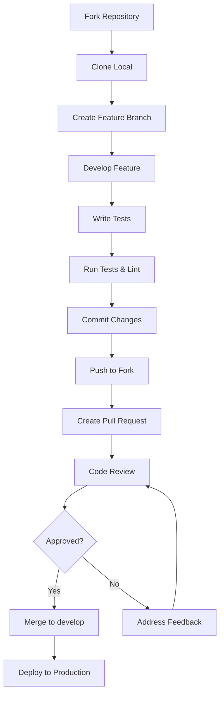

# Guia de Contribuição

Obrigado por considerar contribuir para o `@phdiniiz/comercialTime`! Este documento fornece diretrizes e informações sobre como contribuir para este projeto.

## 📋 Índice

- [Código de Conduta](#-código-de-conduta)
- [Como Contribuir](#-como-contribuir)
- [Fluxo de Trabalho](#-fluxo-de-trabalho)
- [Padrões de Código](#-padrões-de-código)
- [Processo de Revisão](#-processo-de-revisão)
- [Reportar Bugs](#-reportar-bugs)
- [Sugerir Features](#-sugerir-features)
- [Políticas de Merge](#-políticas-de-merge)

## 🤝 Código de Conduta

Este projeto segue um código de conduta para garantir um ambiente acolhedor e inclusivo para todos os contribuidores.

### Nossos Compromissos

- **Respeito**: Tratamos todos com respeito e dignidade
- **Inclusão**: Bem-vindos contribuidores de todas as origens
- **Colaboração**: Trabalhamos juntos para o sucesso do projeto
- **Profissionalismo**: Mantemos um ambiente profissional e construtivo

### Comportamentos Inaceitáveis

- Linguagem ou imagens ofensivas
- Comentários depreciativos ou pessoais
- Assédio público ou privado
- Publicação de informações privadas sem permissão

## 🚀 Como Contribuir

### 1. **Fork e Clone**

```bash
# 1. Fork o repositório no GitHub
# 2. Clone seu fork
git clone https://github.com/PHDiniiz/comercialHours.git
cd comercialHours

# 3. Adicionar o repositório original como upstream
git remote add upstream https://github.com/PHDiniiz/comercialHours.git
```

### 2. **Configurar Ambiente**

```bash
# Instalar dependências
pnpm install

# Executar testes
pnpm test

# Executar linting
pnpm run lint

# Build do projeto
pnpm run build
```

### 3. **Criar Branch**

```bash
# Atualizar branch main
git checkout main
git pull upstream main

# Criar nova branch
git checkout -b feature/nova-funcionalidade
# ou
git checkout -b fix/correcao-bug
# ou
git checkout -b docs/atualizacao-documentacao
```

## 🔄 Fluxo de Trabalho

### **Branches Principais**

- **`main`**: Branch de produção (protegida)
- **`develop`**: Branch de desenvolvimento (protegida)

### **Tipos de Branch Permitidos**

- **`feature/`**: Novas funcionalidades
- **`fix/`**: Correções de bugs
- **`hotfix/`**: Correções críticas para produção
- **`refactor/`**: Refatoração de código
- **`test/`**: Melhorias em testes

### **Tipos de Branch Restritos (Apenas Mantenedores)**

- **`release/`**: Preparação de releases
- **`docs/`**: Atualizações de documentação
- **`chore/`**: Tarefas de manutenção
- **`perf/`**: Melhorias de performance
- **`ci/`**: Mudanças em CI/CD
- **`build/`**: Mudanças no sistema de build

### **Fluxo de Desenvolvimento**



## 📝 Padrões de Código

### **Convenções de Commit**

Seguimos o padrão [Conventional Commits](https://www.conventionalcommits.org/):

```bash
# Formato
<type>(<scope>): <description>

# Exemplos
feat(core): adiciona suporte a timezone
fix(security): corrige vulnerabilidade XSS
docs(readme): atualiza documentação de instalação
test(unit): adiciona testes para HorarioComercial
refactor(performance): otimiza cache de feriados
```

### **Tipos de Commit**

- **`feat`**: Nova funcionalidade
- **`fix`**: Correção de bug
- **`docs`**: Documentação
- **`style`**: Formatação, sem mudança de código
- **`refactor`**: Refatoração de código
- **`test`**: Adição ou correção de testes
- **`chore`**: Tarefas de manutenção
- **`perf`**: Melhoria de performance
- **`ci`**: Mudanças em CI/CD
- **`build`**: Mudanças no sistema de build

### **Padrões de Código**

#### **TypeScript**

```typescript
// ✅ Bom
interface HorarioComercialConfig {
  readonly abertura: string;
  readonly fechamento: string;
}

class HorarioComercial {
  private readonly config: HorarioComercialConfig;
  
  constructor(config: HorarioComercialConfig) {
    this.config = config;
  }
  
  public estaAberto(data?: Date): boolean {
    // Implementação
  }
}

// ❌ Ruim
class horarioComercial {
  config: any;
  
  constructor(config: any) {
    this.config = config;
  }
  
  estaAberto(data?: any): any {
    // Implementação
  }
}
```

#### **Nomenclatura**

- **Classes**: PascalCase (`HorarioComercial`)
- **Interfaces**: PascalCase (`HorarioComercialConfig`)
- **Funções**: camelCase (`estaAberto`)
- **Variáveis**: camelCase (`proximaAbertura`)
- **Constantes**: UPPER_SNAKE_CASE (`MAX_FERIADOS`)
- **Arquivos**: kebab-case (`horario-comercial.ts`)

#### **Documentação**

```typescript
/**
 * Verifica se o estabelecimento está aberto em uma data específica
 * 
 * @param data - Data para verificação (opcional, usa data atual se não informada)
 * @returns true se estiver aberto, false caso contrário
 * 
 * @example
 * ```typescript
 * const horario = new HorarioComercial(config);
 * const aberto = horario.estaAberto(new Date('2024-01-08 14:30'));
 * console.log(aberto); // true ou false
 * ```
 */
public estaAberto(data?: Date): boolean {
  // Implementação
}
```

### **Testes**

#### **Estrutura de Testes**

```typescript
describe('HorarioComercial', () => {
  describe('estaAberto', () => {
    it('deve retornar true quando estiver no horário comercial', () => {
      // Arrange
      const config = { abertura: '08:00', fechamento: '18:00' };
      const horario = new HorarioComercial(config);
      
      // Act
      const resultado = horario.estaAberto(new Date('2024-01-08 14:30'));
      
      // Assert
      expect(resultado).toBe(true);
    });
    
    it('deve retornar false quando estiver fora do horário comercial', () => {
      // Arrange
      const config = { abertura: '08:00', fechamento: '18:00' };
      const horario = new HorarioComercial(config);
      
      // Act
      const resultado = horario.estaAberto(new Date('2024-01-08 20:00'));
      
      // Assert
      expect(resultado).toBe(false);
    });
  });
});
```

#### **Cobertura de Testes**

- **Mínimo**: 80% de cobertura
- **Branches**: 80%
- **Functions**: 80%
- **Lines**: 80%
- **Statements**: 80%

## 🔍 Processo de Revisão

### **Checklist para Pull Requests**

#### **Antes de Enviar**

- [ ] Código segue os padrões definidos
- [ ] Testes passam (`pnpm test`)
- [ ] Linting passou (`pnpm run lint`)
- [ ] Build passou (`pnpm run build`)
- [ ] Documentação atualizada
- [ ] Commits seguem o padrão conventional
- [ ] Branch atualizada com `develop`

#### **Durante a Revisão**

- [ ] Código é legível e bem documentado
- [ ] Lógica está correta
- [ ] Performance é adequada
- [ ] Segurança foi considerada
- [ ] Testes cobrem os casos de uso
- [ ] Não quebra funcionalidades existentes

### **Critérios de Aprovação**

1. **Código**:
   - ✅ Segue os padrões de código
   - ✅ Passa em todos os testes
   - ✅ Não introduz vulnerabilidades
   - ✅ Documentação atualizada

2. **Funcionalidade**:
   - ✅ Implementa o solicitado
   - ✅ Não quebra funcionalidades existentes
   - ✅ Performance adequada

3. **Qualidade**:
   - ✅ Cobertura de testes adequada
   - ✅ Linting passou
   - ✅ Type checking passou

## 🐛 Reportar Bugs

### **Template de Bug Report**

```markdown
## 🐛 Descrição do Bug

Descrição clara e concisa do bug.

## 🔄 Passos para Reproduzir

1. Vá para '...'
2. Clique em '...'
3. Role para baixo até '...'
4. Veja o erro

## ✅ Comportamento Esperado

Descrição clara do que deveria acontecer.

## ❌ Comportamento Atual

Descrição do que está acontecendo.

## 📸 Screenshots

Se aplicável, adicione screenshots.

## 🖥️ Ambiente

- OS: [ex: Windows 10, macOS 12.0, Ubuntu 20.04]
- Node.js: [ex: 22.0.0]
- Versão do pacote: [ex: 1.0.0]

## 📋 Informações Adicionais

Qualquer outra informação relevante.
```

### **Severidade de Bugs**

- **🔴 Critical**: Quebra funcionalidade principal
- **🟠 High**: Afeta funcionalidade importante
- **🟡 Medium**: Afeta funcionalidade secundária
- **🟢 Low**: Problema menor ou cosmético

## ✨ Sugerir Features

### **Template de Feature Request**

```markdown
## ✨ Descrição da Feature

Descrição clara da funcionalidade desejada.

## 🎯 Problema que Resolve

Descrição do problema que esta feature resolveria.

## 💡 Solução Proposta

Descrição da solução que você gostaria de ver implementada.

## 🔄 Alternativas Consideradas

Outras soluções que você considerou.

## 📋 Critérios de Aceitação

- [ ] Critério 1
- [ ] Critério 2
- [ ] Critério 3

## 📸 Mockups/Exemplos

Se aplicável, adicione mockups ou exemplos.

## 📋 Informações Adicionais

Qualquer outra informação relevante.
```

### **Prioridade de Features**

- **🔴 Critical**: Essencial para o projeto
- **🟠 High**: Importante para muitos usuários
- **🟡 Medium**: Útil para alguns usuários
- **🟢 Low**: Nice to have

## 🔒 Políticas de Merge

### **Proteção de Branches**

- **`main`**: Requer aprovação do mantenedor
- **`develop`**: Requer aprovação do mantenedor
- **Outras branches**: Sem proteção

### **Requisitos para Merge**

1. **Status Checks**:
   - ✅ Test & Lint
   - ✅ Build & Validate
   - ✅ Security Scan
   - ✅ Code Quality

2. **Revisão**:
   - ✅ 1 aprovação mínima
   - ✅ Revisão do mantenedor
   - ✅ Sem conflitos

3. **Qualidade**:
   - ✅ Cobertura de testes > 80%
   - ✅ Linting passou
   - ✅ Type checking passou

### **Auto-Merge**

Para PRs aprovados, você pode usar auto-merge:

1. Aplicar label `auto-merge`
2. PR será mergeado automaticamente quando todos os checks passarem
3. Útil para PRs menores ou correções simples

### **Merge Strategies**

- **Squash and Merge**: Para features completas
- **Rebase and Merge**: Para commits limpos
- **Merge Commit**: Para branches complexas

## 🏷️ Labels e Categorização

### **Labels Obrigatórias**

- **Tipo**: `bug`, `enhancement`, `feature`, `hotfix`, `release`
- **Prioridade**: `low`, `medium`, `high`, `critical`
- **Status**: `needs-review`, `approved`, `blocked`, `auto-merge`

### **Labels de Categorização**

- **Área**: `core`, `security`, `performance`, `docs`, `tests`
- **Complexidade**: `simple`, `moderate`, `complex`
- **Breaking**: `breaking-change`, `backward-compatible`

## 🚨 Políticas de Emergência

### **Hotfixes Críticos**

Para bugs críticos em produção:

1. **Aplicar label `emergency`**
2. **Bypass temporário das proteções**
3. **Merge direto após correção**
4. **Documentar o motivo no PR**

### **Rollback**

```bash
# 1. Identificar commit problemático
git log --oneline

# 2. Criar branch de rollback
git checkout main
git checkout -b hotfix/rollback-v1.2.0

# 3. Reverter commit
git revert <commit-hash>

# 4. Push e criar PR
git push origin hotfix/rollback-v1.2.0
```

## 📊 Métricas e Monitoramento

### **Métricas Importantes**

- **Tempo médio de merge**: < 24 horas
- **Taxa de aprovação**: > 95%
- **Taxa de falha em produção**: < 1%
- **Cobertura de testes**: > 80%

### **Alertas**

- **PRs abertos há mais de 48 horas**
- **Falhas em checks críticos**
- **Vulnerabilidades de segurança**
- **Quebras de build**

## 🛠️ Ferramentas e Recursos

### **Ferramentas Recomendadas**

- **Editor**: VS Code com extensões TypeScript
- **Terminal**: Git Bash (Windows) ou Terminal nativo
- **Package Manager**: pnpm
- **Testing**: Jest
- **Linting**: ESLint + Prettier

### **Recursos Úteis**

- [Conventional Commits](https://www.conventionalcommits.org/)
- [Semantic Versioning](https://semver.org/)
- [TypeScript Handbook](https://www.typescriptlang.org/docs/)
- [Jest Documentation](https://jestjs.io/docs/getting-started)

## 📞 Suporte

### **Canais de Comunicação**

- **Issues**: Para bugs e feature requests
- **Discussions**: Para dúvidas e discussões
- **Pull Requests**: Para contribuições de código

### **Tempo de Resposta**

- **Bugs críticos**: < 24 horas
- **Bugs normais**: < 72 horas
- **Feature requests**: < 1 semana
- **Pull requests**: < 48 horas

## 🙏 Agradecimentos

Obrigado por contribuir para este projeto! Sua contribuição é muito valorizada e ajuda a tornar o `@phdiniiz/comercialTime` melhor para todos os usuários.

---

**📋 Resumo**: Este guia estabelece um processo claro e estruturado para contribuições, garantindo qualidade, segurança e colaboração eficiente no desenvolvimento do projeto.
